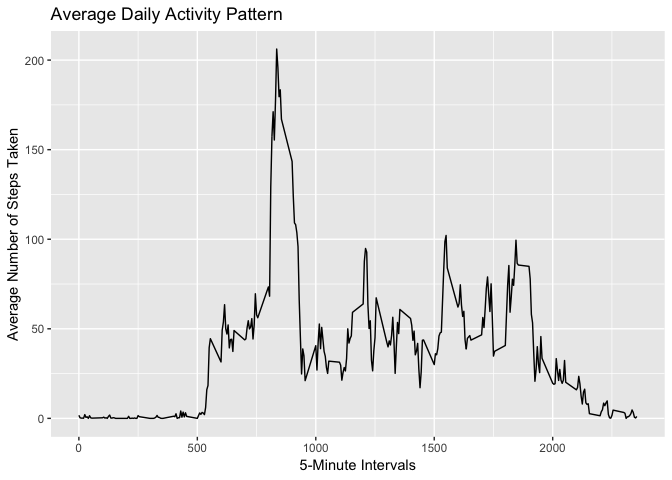
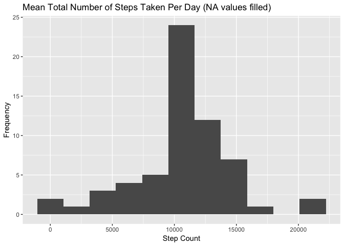

## Introduction

It is now possible to collect a large amount of data about personal movement using activity monitoring devices such as a
[Fitbit](http://www.fitbit.com), [Nike Fuelband](http://www.nike.com/us/en_us/c/nikeplus-fuelband), or [Jawbone Up](https://jawbone.com/up). These type of devices are part of the "quantified self" movement -- a group of enthusiasts who take measurements about themselves regularly to improve their health, to find patterns in their behavior, or because they are tech geeks. But these data remain under-utilized both because the raw data are hard to obtain and there is a lack of statistical methods and software for processing and interpreting the data.  

This assignment makes use of data from a personal activity monitoring device. This device collects data at 5 minute intervals through out the day. The data consists of two months of data from an anonymous individual collected during the months of October and November, 2012 and include the number of steps taken in 5 minute intervals each day.  

## Data

The data for this assignment can be downloaded from the course web site:
* Dataset: [Activity monitoring data](https://d396qusza40orc.cloudfront.net/repdata%2Fdata%2Factivity.zip) [52K]  

The variables included in this dataset are:  
* **steps**: Number of steps taking in a 5-minute interval (missing values are coded as `NA`)  
* **date**: The date on which the measurement was taken in YYYY-MM-DD format  
* **interval**: Identifier for the 5-minute interval in which measurement was taken  

## Load libraries

```r
library(dplyr)
```

```
## 
## Attaching package: 'dplyr'
```

```
## The following objects are masked from 'package:stats':
## 
##     filter, lag
```

```
## The following objects are masked from 'package:base':
## 
##     intersect, setdiff, setequal, union
```

```r
library(magrittr)
library(ggplot2)
```

## Loading and preprocessing the data

```r
unzip("activity.zip", exdir = ".")
df <- read.csv("activity.csv")
df$date <- as.Date(df$date)
```

Preview data:

```r
print(head(df))
```

```
##   steps       date interval
## 1    NA 2012-10-01        0
## 2    NA 2012-10-01        5
## 3    NA 2012-10-01       10
## 4    NA 2012-10-01       15
## 5    NA 2012-10-01       20
## 6    NA 2012-10-01       25
```


## What is mean total number of steps taken per day?

```r
steps.df <- df %>%
  group_by(date) %>%
  summarise(steps = sum(steps))

ggplot(steps.df, aes(x = steps)) +
  geom_histogram(bins = 11) +
  labs(title = "Mean Total Number of Steps Taken Per Day",
       x = "Step Count",
       y = "Frequency")
```

```
## Warning: Removed 8 rows containing non-finite values (stat_bin).
```

<!-- -->

```r
mean(steps.df$steps, na.rm = TRUE)
```

```
## [1] 10766.19
```

```r
median(steps.df$steps, na.rm = TRUE)
```

```
## [1] 10765
```


## What is the average daily activity pattern?

```r
average.daily.df <- df %>%
  group_by(interval) %>%
  summarize(mean.steps = mean(steps, na.rm = TRUE)) %>%
  ungroup()

ggplot(average.daily.df, aes(x = interval, y = mean.steps)) +
  geom_line() +
  labs(title = "Average Daily Activity Pattern",
       x = "5-Minute Intervals",
       y = "Average Number of Steps Taken")
```

<!-- -->

On average across all the days in the dataset, the 5-minute interval contains the maximum number of steps?


```r
average.daily.df %>%
  filter(mean.steps == max(mean.steps))
```

```
## # A tibble: 1 x 2
##   interval mean.steps
##      <int>      <dbl>
## 1      835       206.
```

## Imputing missing values
First, find the number of NA values in the data.

```r
sum(is.na(average.daily.df$steps))
```

```
## Warning: Unknown or uninitialised column: 'steps'.
```

```
## [1] 0
```

Replace NA values with the mean steps of that interval.

```r
df.no.na <- df %>%
  left_join(average.daily.df, by = "interval") %>%
  mutate(steps = ifelse(is.na(steps), mean.steps, steps)) %>%
  select(-mean.steps)
```

Preview data

```r
print(head(df.no.na))
```

```
##       steps       date interval
## 1 1.7169811 2012-10-01        0
## 2 0.3396226 2012-10-01        5
## 3 0.1320755 2012-10-01       10
## 4 0.1509434 2012-10-01       15
## 5 0.0754717 2012-10-01       20
## 6 2.0943396 2012-10-01       25
```

Histogram of the total number of steps taken each day after filling na with mean values of that interval

```r
steps.df.no.na <- df.no.na %>%
  group_by(date) %>%
  summarise(steps = sum(steps))

ggplot(steps.df.no.na, aes(x = steps)) +
  geom_histogram(bins = 11) +
  labs(title = "Mean Total Number of Steps Taken Per Day (NA values filled)",
       x = "Step Count",
       y = "Frequency")
```

<!-- -->

```r
mean(steps.df.no.na$steps, na.rm = TRUE)
```

```
## [1] 10766.19
```

```r
median(steps.df.no.na$steps, na.rm = TRUE)
```

```
## [1] 10766.19
```

Median value of number of steps converges towards the mean value.  This is because with more data filled with the mean values, there is an increased number of values around the mean value.

## Are there differences in activity patterns between weekdays and weekends?

```r
weekday.steps.df <- df.no.na %>%
  mutate(weekday = ifelse(weekdays(date) %in% c("Saturday", "Sunday"), "Weekend", "Weekday")) %>%
  group_by(weekday, interval) %>%
  summarize(mean.steps = mean(steps, na.rm = TRUE))

ggplot(weekday.steps.df, aes(interval, mean.steps)) +
  geom_line() +
  facet_grid(weekday ~ .) +
  labs(title = "Differences in activity patterns between weekdays and weekends",
       x = "5-minute Interval",
       y = "Number of Steps")
```

<!-- -->
